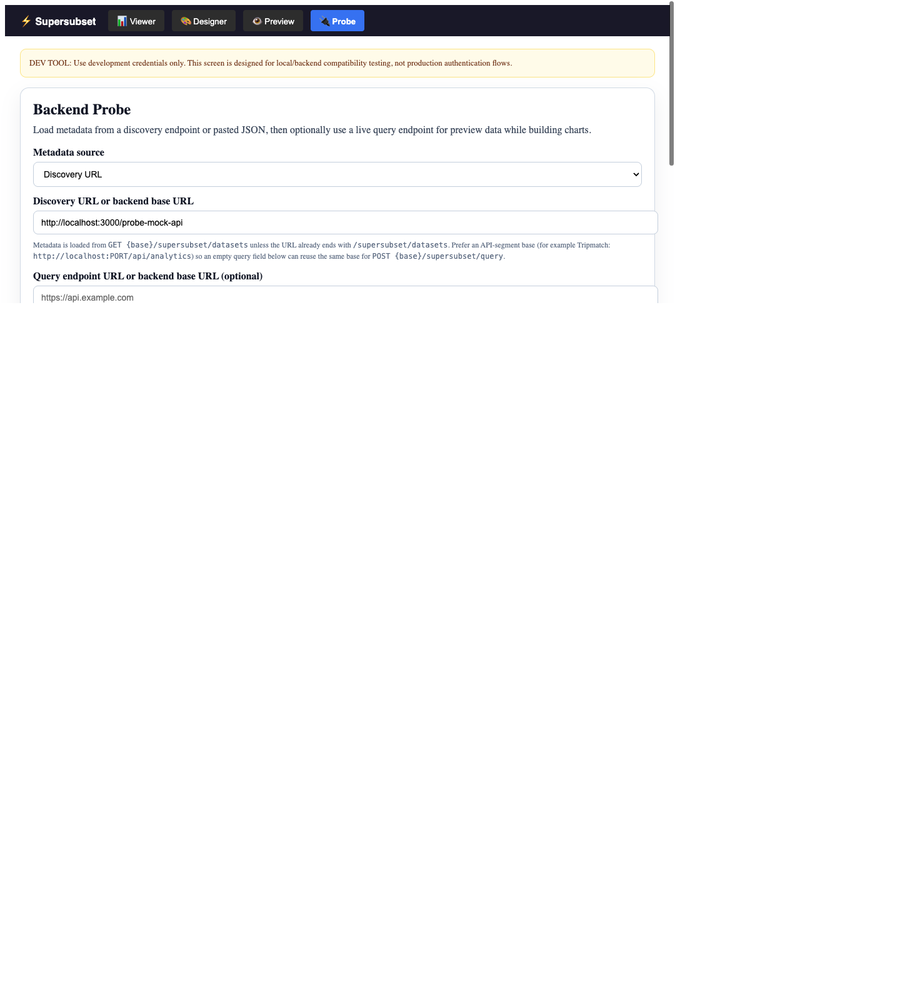
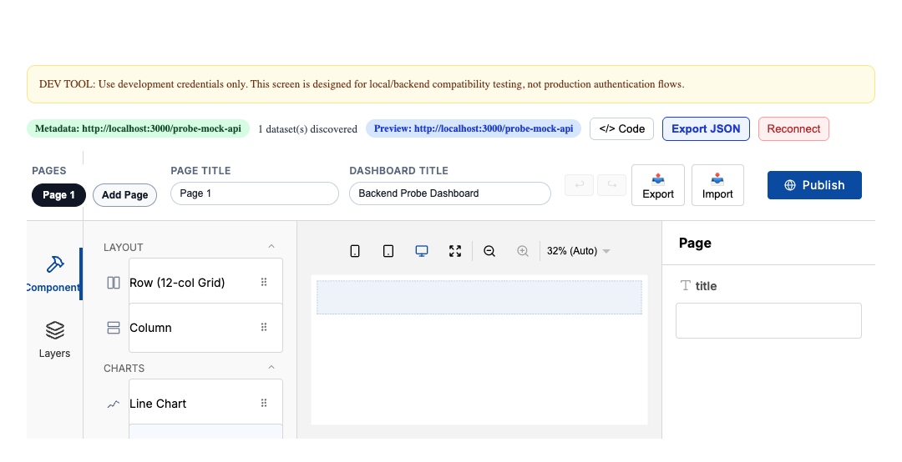

# Backend Probe Guide

The backend probe is the fastest way to validate that a host backend is Supersubset-compatible before you commit dashboard JSON into an application.

It runs inside the dev app and connects the existing designer to a live metadata/query endpoint owned by your host.

## What It Does

The probe lets you:

- point Supersubset at a live backend base URL or discovery endpoint
- send development auth headers without wiring a full host shell first
- load discovered datasets directly into the designer metadata context
- build a dashboard against those datasets
- export the resulting `DashboardDefinition` JSON for use in your app

## Start The Probe

1. Start the dev app with `pnpm dev`.
2. Open the dev app in the browser.
3. Switch to `Probe` mode from the top toolbar.
4. Choose a metadata source:
   - `Discovery URL` for a live backend
   - `Paste metadata JSON` for a static dry run

For a live backend, enter a base URL such as `http://localhost:3000/api/analytics`.

The probe treats that as:

```text
GET  {base}/supersubset/datasets
POST {base}/supersubset/query
```

If you paste a terminal URL ending in `/supersubset/datasets`, `/datasets`, `/supersubset/query`, or `/query`, the probe uses it as-is.

## Choose An Auth Mode

The probe supports three development-friendly auth options:

- `Bearer JWT`: paste the raw token and the probe adds the `Bearer` prefix
- `Custom header`: send any header/value pair such as `X-API-Key`
- `Login with email + password`: POST a GraphQL login mutation, extract a token, then reuse it as a bearer token

The `Remember settings in sessionStorage` checkbox persists the probe form for the current browser session only.

## What Success Looks Like

After clicking `Load metadata and open designer`, a successful connection shows:

- a green metadata badge
- a dataset count
- the `Supersubset Probe Designer` header
- the normal designer UI, now backed by the discovered datasets

The canvas is intentionally blank at this point. That is expected. The success signal is not a prebuilt dashboard; it is a blank dashboard with live datasets available in field pickers, chart blocks, filters, and preview queries.

## Before And After

Before connecting, the probe presents a dev-only form for the discovery URL, optional query URL, and auth settings:



After a successful probe, the same screen transitions into a blank designer with discovered datasets loaded and export/reconnect controls available:



## Discovery Contract

The recommended discovery response is the canonical probe envelope:

```json
{
  "protocolVersion": "v1",
  "capabilities": {
    "supportedAggregations": ["sum", "avg", "count", "min", "max", "none"],
    "supportedFilterOperators": ["eq", "neq", "gt", "gte", "lt", "lte", "in"],
    "supportedSourceTypes": ["table", "view", "model", "query", "file"],
    "supportsMetadataDiscovery": true,
    "supportsQueryExecution": true
  },
  "datasets": [
    {
      "id": "orders",
      "label": "Orders",
      "fields": [
        { "id": "region", "label": "Region", "dataType": "string", "role": "dimension" },
        {
          "id": "revenue",
          "label": "Revenue",
          "dataType": "number",
          "role": "measure",
          "defaultAggregation": "sum"
        },
        { "id": "ordered_at", "label": "Ordered At", "dataType": "date", "role": "time" }
      ]
    }
  ]
}
```

For compatibility, the current probe also accepts:

- `NormalizedDataset[]`
- `{ "datasets": [...] }`

## Query Contract

Preview queries are sent as logical queries to the query endpoint.

Example request:

```json
{
  "datasetId": "orders",
  "fields": [
    { "fieldId": "region" },
    { "fieldId": "revenue", "aggregation": "sum", "alias": "total_revenue" }
  ],
  "groupBy": ["region"],
  "limit": 50
}
```

Recommended response:

```json
{
  "protocolVersion": "v1",
  "capabilities": {
    "supportedAggregations": ["sum", "avg", "count", "min", "max", "none"],
    "supportedFilterOperators": ["eq", "neq", "gt", "gte", "lt", "lte", "in"],
    "supportedSourceTypes": ["table", "view", "model", "query", "file"],
    "supportsMetadataDiscovery": true,
    "supportsQueryExecution": true
  },
  "columns": [
    { "fieldId": "region", "label": "Region", "dataType": "string" },
    { "fieldId": "total_revenue", "label": "Total Revenue", "dataType": "number" }
  ],
  "rows": [
    { "region": "West", "total_revenue": 125000 },
    { "region": "East", "total_revenue": 118000 }
  ]
}
```

The probe also tolerates a plain `QueryResult` shape because the designer preview consumes `columns` and `rows` directly.

## Export The Dashboard

Once the designer is loaded:

1. Build widgets against the discovered datasets.
2. Click `Export JSON`.
3. The probe copies the dashboard JSON to the clipboard when possible and also downloads a `.json` file.

That file is the canonical `DashboardDefinition` you can persist in your host application.

## Troubleshooting

### Designer looks blank after connect

This is usually expected. The probe opens a blank dashboard, not a starter dashboard. Verify success by checking:

- the dataset count badge
- the `Supersubset Probe Designer` header
- field pickers inside chart blocks showing your discovered fields

If those are missing, the connection likely failed before datasets were loaded.

### No datasets were discovered

The backend returned an empty dataset list. Confirm that the discovery endpoint returns at least one normalized dataset.

### Query preview stays disabled

Preview queries are disabled when there is no query endpoint URL and the discovery URL cannot be reused as a query base.

### Auth works in curl but fails in the browser

The probe runs in the browser, so CORS still applies. Confirm that the backend allows the dev app origin and any auth headers you are sending.

## Related References

- [Metadata And CLI API](../api/metadata-and-cli.md)
- [ADR-008: Supersubset HTTP Probe Contract](../adr/008-supersubset-http-probe-contract.md)
